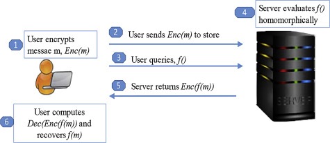

# HE scenario
The homomorphic encryption is a special kind of encryption mechanism that can resolve the security and privacy issues. Unlike the public key encryption, which has three security procedures, i.e., key generation, encryption and decryption; there are four procedures in HE scheme, including the evaluation algorithm as shown in Fig. 1. The HE allows the third party service providers to perform certain type of operations on the user's encrypted data without decrypting the encrypted data, while maintaining the privacy of the users' encrypted data. In homomorphic encryption, if the user wants to query some information on the cloud server, he first encrypts the data and stores the encrypted data in the cloud. Then, after sometime, the user sends query information to the cloud server. The cloud server runs a prediction algorithm on encrypted data using HE without knowing the contents of the encrypted data. Then, the cloud returns the encrypted prediction back to the user and the user decrypts the received encrypted data using the user's secret key, while preserving the privacy of his data as show in Fig. 1. In HE, mathematical operation on the plaintext during encryption is equivalent to another operation performed on the cipher text. Let us consider a simple homomorphic operation on the plaintext with the corresponding cipher text operation.

## Case
### Form Statistics
Group A needs to count the financial reports of its subsidiaries. In order to guarantee the tamper-proof of financial statements, the financial statements are written into the blockchain, but since the blockchain data is essentially public, it may be leaked. If the public key is used to encrypt the financial statements, it is still necessary to obtain the cipher text and decrypt it locally before calculating the statistical reports, and this process does not guarantee that the data will not be tampered with.  
The problem can be simplified to calculate the sum of the revenues of the items on the form in the ciphertext ti'a
|form1|items|revenue|
| :---: | --- | --- |
|  | item1 | 2000|
|  |item2|-1000|
|  |item3|2000|